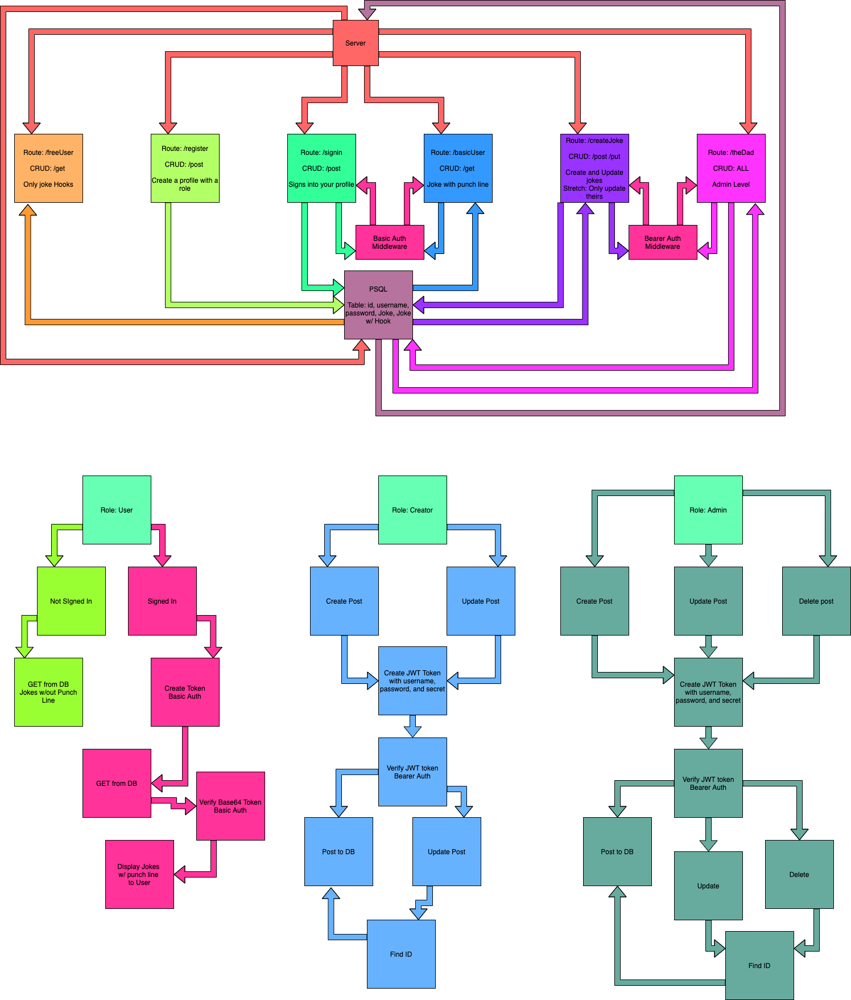

# Dad Jokes Auth Api

## Description

Welcome to Dad Jokes! Here you can see all of our lovely dad jokes, and with access, you can be permitted to create, update, or even delete jokes!

## Authors

- Heather Bisgaard, Software Engineer
- Charlie Fadness, Software Developer
- Ayrat Gimranov, Full Stack Front End Developer

## Deployed Link

[Heroku Link](https://dad-jokes-auth-api.herokuapp.com/)

## Data Modeling

### UML and WRRC

  

### White Board


## Auth

Auth is hashing out password along with our username that creates a hashed password and username.

## Technology Used

`"base-64": "^1.0.0"`  
`"bcrypt": "^5.0.0"`  
`"cors": "^2.8.5"`  
`"dotenv": "^8.2.0"`  
`"express": "^4.17.1"`  
`"jest": "^26.6.3"`  
`"morgan": "^1.10.0"`  
`"pg": "^8.6.0"`  
`"sequelize": "^6.6.2"`  
`"sequelize-cli": "^6.2.0"`  
`"sqlite3": "^5.0.2"`  
`"supertest": "^6.1.3"`  

## CRUD

POST route for `/register`

```
Accepts JSON or FORM Data with the keys "username" and "password"
Uses postgres to create your new record
Returns a 201 for your created user record
```

POST route for `/signin`

```
Using middleware, we authicate your information with encoding to log in
When validated, sends JSON user record
```

GET route for `/users`

```
Using middleware, we authicate your encryption to display the users that have registered
```

POST route for `/secret`

```
Using middleware, we authicate your information to view specialized secret documents
```

## RESTful API

- `/joke` is REST with middleware auth
  - Here we have roles set, the level of role will depend on how many things you can complete with a RESTful API.

Get route for `/get` `/joke`

```
Using REST we grab all our data, if you add "/joke/#", you can view a specific entry 
```

Post route for `/post` `/joke`

```
Using REST we can post data into our server. Models using "name", "filling", and "frosting"
```

Update route for `/put` `/joke/#`

```
Using REST we can update data into our server depending on the specific entry. Models using "name", "filling", and "frosting" to update the entry
```

Delete route for `/delete` `/joke/#`

```
Using REST we can delete data into our server depending on the specific entry.
```

## Routes

```
/register

/signin

/users

/secret

/joke

/joke/#
```

## Testing

```
While creating tests, we wanted to focus on routes, RESTful API, and making sure they all worked with Insomnia or Postman.
```

## Install

```
npm i
```

## Usage

```
npm run dev
```

## Other

Create a `.env` file following our sample env. 
  Add in DATABASE_URL, SECRET, and PORT
